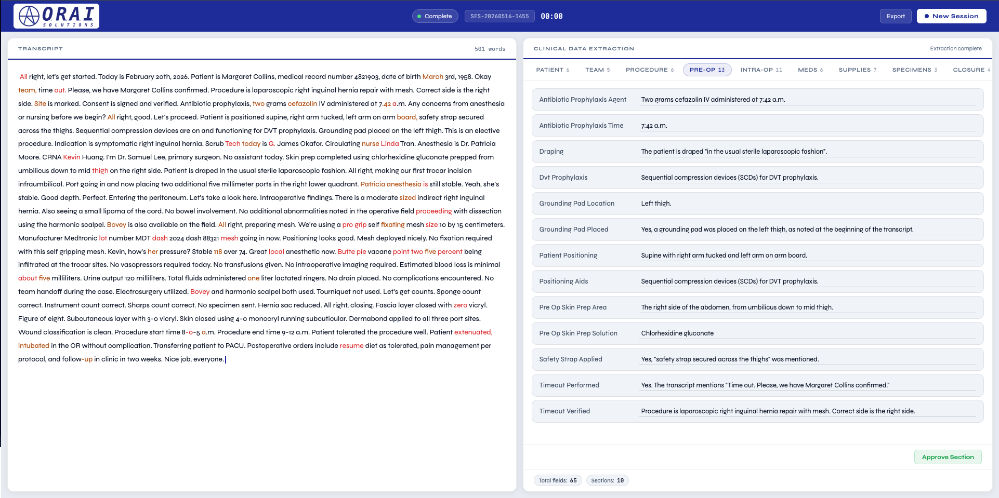

# Operating Room Charting Assistant (ORCA)

> **⚠️ Educational project. Not a medical device. Not for clinical use.**
> See the [Disclaimer](#disclaimer) below before using.

ORCA is a local, end-to-end pipeline that records operating-room audio, transcribes it with [faster-whisper](https://github.com/SYSTRAN/faster-whisper), and uses a local LLM (via [Ollama](https://ollama.com)) to extract structured clinical data into a configurable JSON template. A single-page web UI streams the transcript and extracted fields live as a procedure progresses.

Everything runs on the local machine — no cloud calls, no external APIs.



## Pipeline

```
   Microphone
       │
       ▼
  rec_v2.py ─────────── WAV file
       │
       ▼
  asr_v3.py ─────────── transcript (word-level + confidence)
       │
       ▼
  cde_v5.py ─────────── JSON report (one LLM call per field)
       │
       ▼
   server.py / orca_ui.html
```

## Repository layout

| File | Purpose |
|------|---------|
| [rec_v2.py](rec_v2.py) | Microphone capture → timestamped WAV |
| [asr_v3.py](asr_v3.py) | faster-whisper transcription with streaming callback |
| [cde_v5.py](cde_v5.py) | Clinical data extraction via Ollama |
| [server.py](server.py) | Flask server orchestrating the pipeline |
| [orca_ui.html](orca_ui.html) | Web UI (live transcript + editable CDE) |
| [report_template_1.json](report_template_1.json) | Schema of fields to extract |
| [asr_val.py](asr_val.py) | ASR accuracy benchmarking (HF MedDialog-Audio) |
| [cde_val.py](cde_val.py) | CDE benchmarking across LLMs |
| [hardware/](hardware/) | STL + G-code for 3D-printed recording device enclosure |

## Prerequisites

- **Python 3.11+**
- **[Ollama](https://ollama.com)** running locally
- A working microphone
- macOS or Linux (Windows untested)

## Quickstart

```bash
git clone https://github.com/kadenkobashigawa/Operating-Room-Charting-Assistant-ORCA.git
cd Operating-Room-Charting-Assistant-ORCA

python -m venv orca_env
source orca_env/bin/activate
pip install -r requirements.txt

# Start Ollama and pull the default model
brew services start ollama          # macOS — on Linux: `ollama serve &`
ollama pull llama3.1:8b

# Start the Flask server
flask --app server run --port 5050
```

Then open [orca_ui.html](orca_ui.html) in a browser and click **Start Recording**.

## Configuration

Edit the constants at the top of [server.py](server.py):

```python
ASR_MODEL     = 'large-v3'              # faster-whisper model size
LLM_MODEL     = 'llama3.1:8b'           # any Ollama-pulled model
TEMPLATE_PATH = 'report_template_1.json'
```

The CDE template ([report_template_1.json](report_template_1.json)) defines the sections and fields to extract. Each leaf field carries a `description` that becomes part of the LLM prompt — edit it to fit your use case.

## Validation

- [asr_val.py](asr_val.py) — Benchmarks Whisper model sizes against the [MedDialog-Audio](https://huggingface.co/datasets/aline-gassenn/MedDialog-Audio) dataset at varying noise levels.
- [cde_val.py](cde_val.py) — Benchmarks several Ollama-hosted LLMs against hand-labeled answer keys in `cde_val/`.

Both write outputs to gitignored folders so you can regenerate them locally.

## Hardware

The [hardware/](hardware/) directory contains STL files and pre-sliced G-code for a 3D-printed enclosure for a Raspberry-Pi-based recording device.

## Security notes

- The Flask server ships with **no authentication** and **wide-open CORS**. It is intended for `localhost` use only — do not expose port 5050 to a network.
- All audio and reports stay on the local machine.
- Files written to `recordings/`, `sessions/`, and `reports/` are gitignored to prevent accidentally committing audio or simulated patient data.

## License

[MIT](LICENSE).

## Disclaimer

ORCA is a research and educational prototype. It is **not** a medical device, has **not** been cleared or approved by any regulatory authority, and has **not** been validated against any clinical standard. It **must not** be used to record, transcribe, or process information about real patients, nor to inform any clinical decision. Output may be inaccurate, incomplete, or hallucinated. Use at your own risk.
